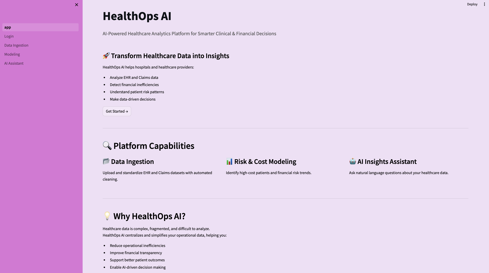
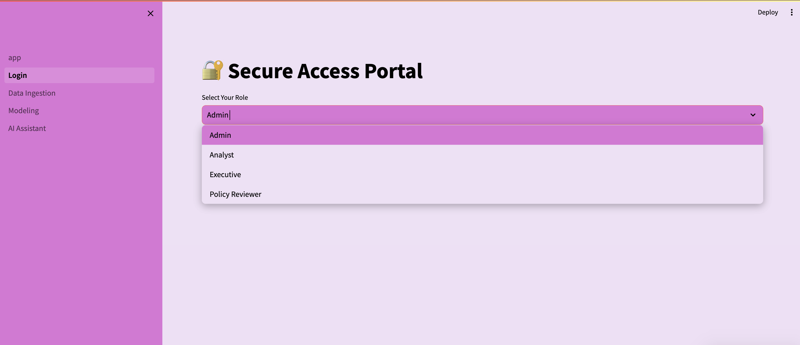
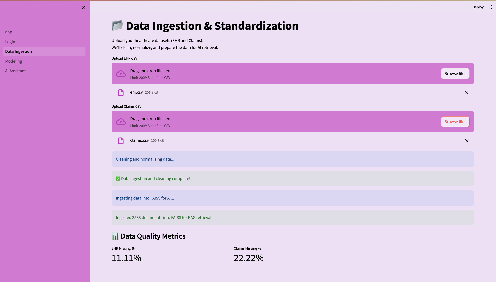
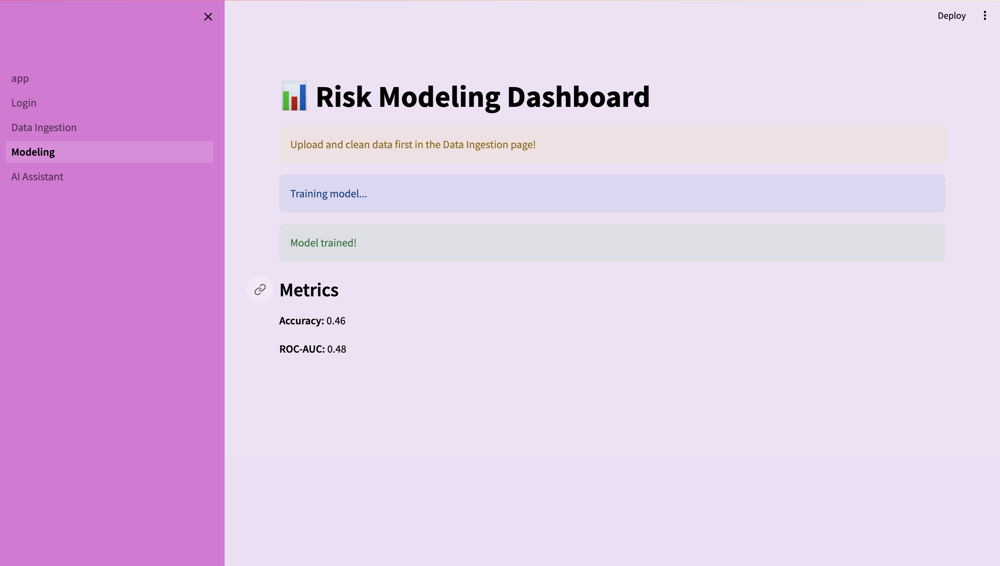
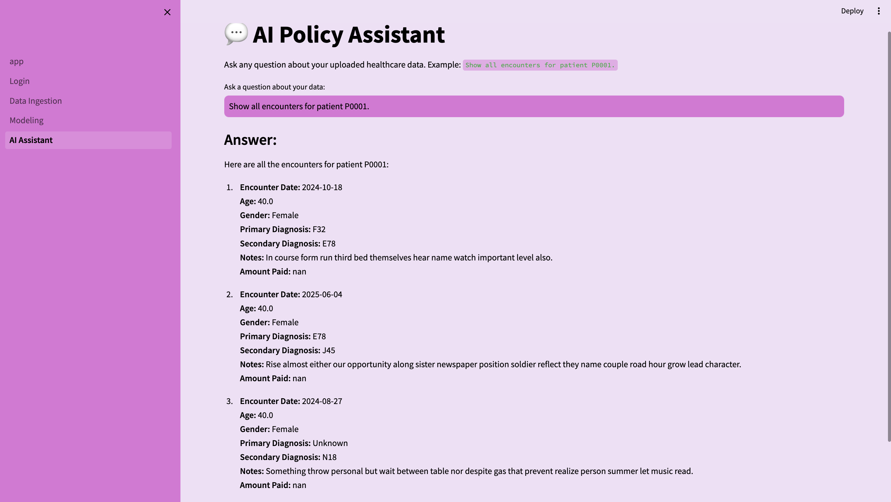

# HealthOps AI 🏥🤖

**HealthOps AI** is a Streamlit-based healthcare analytics platform that allows users to upload, clean, and explore EHR (Electronic Health Records) and Claims data. It also integrates **RAG (Retrieval-Augmented Generation)** using OpenAI’s embeddings and FAISS to answer healthcare data questions intelligently.

---

## Table of Contents

* [Features](#features)
* [Getting Started](#getting-started)
* [Data Upload & Cleaning](#data-upload--cleaning)
* [RAG AI Assistant](#rag-ai-assistant)

---

## Features

* **Data Ingestion:** Upload and standardize EHR & Claims CSV files.
* **Data Cleaning:** Handle missing values, type normalization, and column standardization.
* **Data Quality Metrics:** Visualize missing data percentages, top diagnoses, and procedure counts.
* **RAG AI Assistant:** Ask natural language questions about patients, procedures, and claims.
* **FAISS Vector Store:** Efficiently retrieve relevant healthcare data chunks for AI responses.
* **OpenAI Integration:** Uses GPT-4o-mini for answering data queries.

---

## Getting Started

### 1. Clone the repository

```bash
git clone https://github.com/PalakKakani/healthops_ai.git
cd healthops_ai
````

### 2. Install dependencies

```bash
pip install -r requirements.txt
```

> Ensure you have Python 3.10+.

### 3. Set OpenAI API Key

You can **hardcode** your key in `rag_pipeline.py` or, for better security, use an environment variable:

```bash
export OPENAI_API_KEY="your_openai_api_key_here"
```

---

## Data Upload & Cleaning

* Go to the **Data Ingestion** page in the Streamlit app.
* Upload your **EHR CSV** and **Claims CSV** files.
* The system will automatically clean and normalize data.
* Force all columns to string types to prevent errors like `LargeUtf8`.
* After ingestion, click **“Ingest data into FAISS for AI”** to prepare the RAG pipeline.

---

## RAG AI Assistant

* After ingesting data into FAISS, go to the **AI Assistant** page.
* Ask natural language questions, e.g.:

```
Show all encounters for patient P0001.
What are the top procedures for patient P0002?
How much was paid for claims with diagnosis N18?
```

* The assistant retrieves relevant rows from FAISS and uses GPT-4o-mini to generate answers.
* If data is unavailable, the AI responds:

"This information is not available in the uploaded dataset."

### 1. App Page



### 2. Login Page



### 3. Data Ingestion Page



### 4. Modeling Page



### 5. AI Assistant Page




